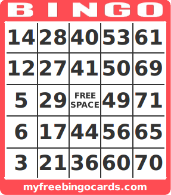

# Java

## Arrays

### Bingo Card Generator

Die Regeln für eine Bingo-Karte sind einfach: 
Eine Bingo Karte besteht aus 24 eindeutigen zufälligen Nummern:
* 5 Zahlen für die B Spalte im Bereich 1 bis 15
* 5 Zahlen für die I Spalte im Bereich 16 bis 30
* 4 Zahlen für die N Spalte im Bereich 31 bis 45
* 5 Zahlen für die G Spalte im Bereich 46 bis 60
* 5 Zahlen für die O Spalte im Bereich 61 bis 75

Schreibe ein kleines Programm, dass eine Bingo-Karte zufällig erzeugt und formattiert auf die Konsole druckt.